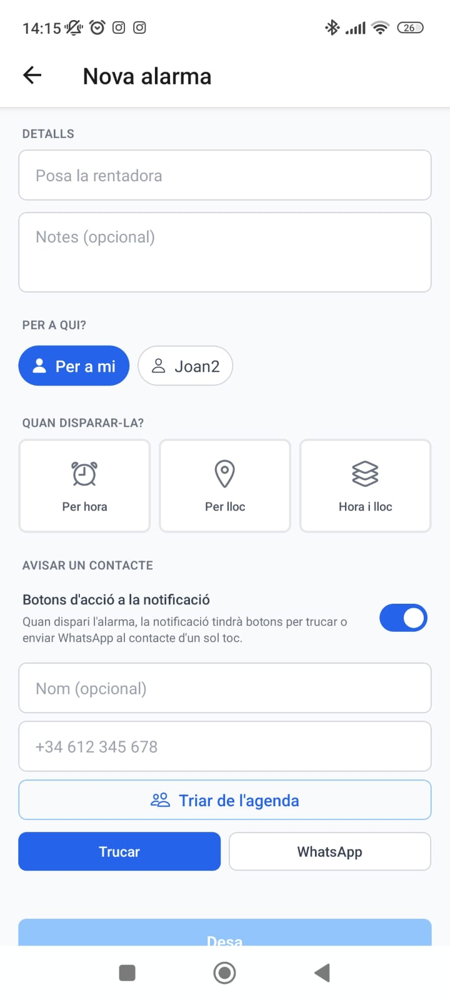
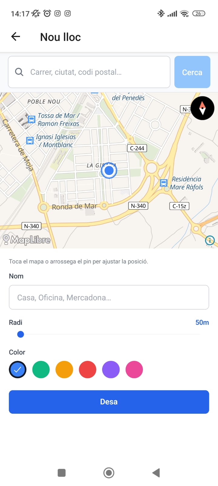

# GeoAlarm

App móvil de agenda con dos tipos de disparador:

- **Por hora** — alarma clásica (ej: "pon la lavadora a las 18:00")
- **Por ubicación** — geofencing (ej: "cuando llegue a casa", "cuando salga de la autopista")

…y combinables (ej: "cuando llegue a casa **entre las 18-22h**, recuérdame poner la lavadora").

Feature diferencial: sistema de amigos donde una persona puede crear alarmas en la agenda de otra (ej: tu pareja te añade "compra leche cuando llegues al Mercadona"). La ubicación nunca se comparte; solo la definición de la alarma.

> _Repo: `Agenda_Geoloc` · Brand del producto: **GeoAlarm** (icon y splash con la identidad visual)._

## Capturas

<table>
<tr>
<td width="50%" valign="top">

<p align="center"><em>Asistente de alarma: 3 tipos de disparador (hora / lugar / combinado), selector de destinatario para alarmas cross-agenda (<code>Per a mi</code> o un amigo), botones Call/WhatsApp al dispararse y picker desde la phonebook.</em></p>
</td>
<td width="50%" valign="top">

<p align="center"><em>Creación de lugar: mapa MapLibre con búsqueda por dirección, pin arrastrable, radio configurable y color personalizable.</em></p>
</td>
</tr>
</table>

## Stack

| Capa | Tecnología |
|---|---|
| Mobile | React Native + Expo SDK 54 (managed) + expo-router + NativeWind v4 + i18n (es/en/ca) |
| State | Zustand (auth) + React Query (server cache) + SecureStore (token) |
| Forms | react-hook-form + zod resolver |
| Mapas | react-native-maps + expo-location |
| Notifs | expo-notifications (locales + geofence) + push remotas (friend requests, cross-agenda alarms) |
| Backend | Node 20 + Express + Better-Auth + Drizzle ORM + Zod |
| DB | Turso (libSQL/SQLite serverless) |
| Repo | pnpm workspaces + TypeScript |
| Hosting | Render (api), EAS Build cloud (APK preview + AAB production) |

## Estructura

```
apps/
├── mobile/        Expo app (3 tabs: Agenda, Lugares, Ajustes)
└── api/           Express + Drizzle + Better-Auth, /api/auth, /api/me, /api/places, /api/alarms

packages/
├── shared/        Zod schemas y tipos compartidos
└── db/            Schema Drizzle + migraciones (drizzle-kit)
```

## Setup local

### Requisitos

- Node 20+
- pnpm (instalar con `npm i -g pnpm` si no lo tienes)
- Cuenta Turso con una database creada
- Para dev móvil: Expo Go para iteración inicial, o development build (local con Android Studio o cloud con EAS Build) para features con código nativo (push remotas, geofencing background)

### Variables de entorno

Copia los `.env.example` y rellena tus credenciales:

```sh
cp apps/api/.env.example apps/api/.env
cp packages/db/.env.example packages/db/.env
cp apps/mobile/.env.example apps/mobile/.env
```

| Archivo | Variables clave |
|---|---|
| `apps/api/.env` | `DATABASE_URL` (libsql://...), `DATABASE_AUTH_TOKEN`, `BETTER_AUTH_SECRET` (32 bytes hex), `BETTER_AUTH_URL` |
| `packages/db/.env` | Mismas vars de DB (drizzle-kit las usa para migraciones) |
| `apps/mobile/.env` | `EXPO_PUBLIC_API_URL` apuntando a la IP LAN del PC para que Expo Go en el móvil alcance la api |

> **Genera el secret de auth** con `node -e "console.log(require('crypto').randomBytes(32).toString('hex'))"`.

### Instalar dependencias

```sh
pnpm install
```

### Migrar la DB

Una vez configurado `packages/db/.env` con tu Turso:

```sh
pnpm db:generate    # solo si tocas el schema
pnpm db:migrate     # aplica las migraciones a Turso
```

## Workflow de desarrollo

Necesitas **dos terminales abiertas en la raíz del proyecto**:

```sh
# Terminal 1 — backend
pnpm dev:api
# Express en http://0.0.0.0:4000

# Terminal 2 — mobile
pnpm dev:mobile
# Metro bundler + QR para Expo Go (Fase 3)
```

Para que el móvil físico (Expo Go o dev build) alcance al api, ambos deben estar **en la misma WiFi** y `apps/mobile/.env` debe apuntar a la IP LAN del PC, p.ej.:

```env
EXPO_PUBLIC_API_URL=http://192.168.1.103:4000
```

Si cambias de red WiFi, actualiza la IP.

## Comandos útiles

```sh
pnpm dev:api              # arranca el backend con tsx watch
pnpm dev:mobile           # arranca Metro + QR
pnpm dev:mobile -- --clear  # arranca limpiando caché Metro (necesario tras añadir deps)
pnpm typecheck            # tsc --noEmit en todos los workspaces
pnpm db:generate          # nueva migración desde el schema
pnpm db:migrate           # aplica migraciones pendientes
pnpm db:studio            # abre Drizzle Studio (UI web para inspeccionar la DB)
```

### Inspeccionar la DB

```sh
node packages/db/scripts/check-users.mjs
```

Muestra users, accounts (con presencia de password) y sesiones recientes en Turso. Útil para depurar problemas de auth.

## Despliegue

### API (Render)

El backend se ejecuta con `tsx` directamente en producción (sin paso de build); a esta escala el coste extra de memoria es trivial y nos ahorra bundlear los workspaces `@agenda/db` y `@agenda/shared` que importan TypeScript directamente.

Crear un **Web Service** en Render apuntando a este repo con:

- **Root directory**: vacío (raíz del repo)
- **Build command**: `npm install`
- **Start command**: `npm run start:api`
- **Environment**: `Node`
- **Plan**: Free (cold start ~30s tras 15min sin tráfico) o Starter ($7/mes, sin hibernación)

Variables de entorno a configurar en el panel de Render:

| Variable | Valor |
|---|---|
| `NODE_ENV` | `production` |
| `DATABASE_URL` | `libsql://...` (tu Turso) |
| `DATABASE_AUTH_TOKEN` | token de Turso |
| `BETTER_AUTH_SECRET` | 32 bytes hex (mismo de dev o uno nuevo) |
| `BETTER_AUTH_URL` | URL pública del servicio Render, p.ej. `https://agenda-api.onrender.com` |
| `EXPO_ACCESS_TOKEN` *(opcional)* | Token de Expo (Account Settings → Access Tokens) para que el backend envíe push notifications con "Enhanced Push Security". Sin token también funciona, pero con menos protección anti-abuse. |

> `PORT` lo asigna Render automáticamente; nuestro `env.ts` lo lee con `z.coerce.number()`.

**Migraciones**: se siguen aplicando desde local con `pnpm db:migrate` apuntando a Turso. Render solo consume la DB; no ejecuta migraciones.

Tras el primer deploy, actualiza `apps/mobile/.env` para que el móvil apunte al backend público:

```env
EXPO_PUBLIC_API_URL=https://agenda-api.onrender.com
```

Y reconstruye la APK (`cd apps/mobile && npx expo run:android`) para que los amigos puedan usarla sin estar en tu VPN.

### Mobile

- **Desarrollo iterativo**: Expo Go en LAN (`pnpm dev:mobile`) o development build local (`cd apps/mobile && npx expo run:android`, requiere Android Studio + USB).
- **Distribución a amigos/testers**: **EAS Build perfil `preview`** — genera un APK descargable por URL desde el cloud (sin USB).
- **Producción Play Store**: EAS Build perfil `production` → genera `.aab` para subir a Google Play.

#### Setup inicial EAS (una vez)

```sh
cd apps/mobile
npm install -g eas-cli         # si no lo tienes
eas login                       # cuenta de expo.dev
eas init                        # vincula el proyecto, escribe extra.eas.projectId en app.json
eas update:configure            # escribe updates.url en app.json y crea canales preview/production
```

Estos comandos modifican `app.json`. Tras ejecutarlos, commitea los cambios.

#### Generar APK preview (sin USB, distribuible a testers)

```sh
cd apps/mobile
eas build --platform android --profile preview
```

EAS construye en el cloud (10-15 min), te da una URL con QR. Los testers la abren en el móvil, descargan el APK e instalan (Android pedirá permitir "fuentes desconocidas" la primera vez).

La URL `EXPO_PUBLIC_API_URL` ya queda incrustada en el bundle según `eas.json` (apunta a Render por defecto en los perfiles `preview` y `production`).

#### Push de updates JS sin rebuild

Para cambios que solo tocan JS/JSX/TS (no nativos, no app.json, no plugins):

```sh
cd apps/mobile
eas update --channel preview --message "Descripción del cambio"
```

Los móviles con el APK `preview` ya instalado descargan el cambio al siguiente arranque. Funciona porque `runtimeVersion: { policy: "appVersion" }` en [app.json](apps/mobile/app.json) liga las updates a la versión nativa: solo cambias módulos nativos o `expo.version` y los APKs antiguos dejan de recibir updates (lo que es correcto — necesitan un APK nuevo).

#### Cuándo SÍ hay que regenerar APK

- Cambios en dependencias nativas (instalas un paquete con código nativo)
- Cambios en `app.json` que afecten al manifest nativo (permissions, plugins, package, version)
- Subes la versión `expo.version` en `app.json` para una release con cambios visibles

## Gotchas conocidos

### pnpm + Expo + monorepo

Combinación con fricciones específicas. Resumen de qué hicimos:

- `apps/mobile/metro.config.js` mantiene `disableHierarchicalLookup` en `false` (no `true` como en monorepos npm/yarn). pnpm necesita que Metro escale el árbol porque las deps transitivas viven en `node_modules/.pnpm/{pkg}/node_modules` como symlinks.
- Si Metro falla con `Unable to resolve "X" from "apps/mobile/app/..."`, normalmente es una dep transitiva que hay que **promover a direct dep**. Casos resueltos: `@expo/metro-runtime`, `react-native-css-interop`, `intl-pluralrules`.
- `packages/shared` usa imports sin `.js` para que Metro los resuelva como `.ts`. `packages/db` mantiene `.js` (drizzle-kit lo ejecuta con NodeNext).
- Tras añadir/cambiar deps, lanza con `pnpm dev:mobile -- --clear`.

### Auth desde móvil

React Native fetch no envía header `Origin` (los browsers sí). Better-Auth tiene un check anti-CSRF que rechaza POST sin Origin. Solución: el cliente RN siempre envía `Origin: http://localhost:8081` (en `lib/api/client.ts`), valor que ya está en `trustedOrigins` del backend.

### Notificaciones

- Locales (`scheduleNotificationAsync` con `DATE` trigger) **funcionan en Expo Go**
- Push remotas y geofencing en background **NO funcionan en Expo Go** — requieren development build (Fase 4)

### Puerto 4000

El backend escucha en `0.0.0.0:4000`. Si tienes otro servicio en ese puerto, edita `PORT` en `apps/api/.env`. Los puertos 3000 y 3001 estaban tomados por servicios del usuario en este proyecto, por eso fuimos a 4000.

## Estado del proyecto

### Fase 1 — Setup ✅
Monorepo, esquema DB inicial, deploy local en marcha.

### Fase 2 — Auth ✅
Better-Auth con email/password, bearer tokens, SecureStore, login/register/logout end-to-end probado en móvil físico contra Turso.

### Fase 3 — CRUD lugares y alarmas ✅
- Backend: endpoints REST con validación Zod
- Mobile: tabs (Agenda / Lugares / Ajustes), formulario de lugar con mapa + búsqueda por dirección, asistente de alarma (3 tipos), notificaciones locales para alarmas de hora

### Fase 4 — Geofencing en background ✅
- Polling + MapLibre + snooze + fire-and-deactivate, unified location-task service
- Iteraciones de fiabilidad: proactive trigger en outside→inside edge, faster updates while moving, debounce 60s en eventos nativos, "nearby" fires at outer radius sin confirmation polling, skip confirmation polling para repeat=always enter
- Requiere development build (no Expo Go)

### Fase 5 — Amigos + cross-agenda alarms ✅
- Sistema de amigos: friend requests + accept/reject + listing
- Place sharing entre amigos
- Cross-agenda alarms: creas una alarma en la agenda de otro usuario; la ubicación nunca se comparte, solo la definición de la alarma. El receptor evalúa el geofencing localmente con su propia ubicación
- Push remotas para friend requests + cross-agenda alarms (cliente Expo Push)
- Mobile UI: pantalla "Sent alarms" (vista del creador), pantalla "pending-alarm detail" (vista del receptor), tab badge para items pendientes, toasts

### Features extra (post-roadmap)

- **Notify contact at fire time**: al dispararse una alarma, ofrece botones Call + WhatsApp directos al contacto seleccionado. Picker desde la phonebook del móvil.
- **Distribución cloud via EAS Build**: APK preview por URL descargable (sin USB) + AAB production para Play Store. Updates OTA con `eas update` para cambios JS sin rebuild.
- **Branding propio**: app icon + splash con identidad visual de la app.

## Licencia

Privado. Sin licencia pública aún.
